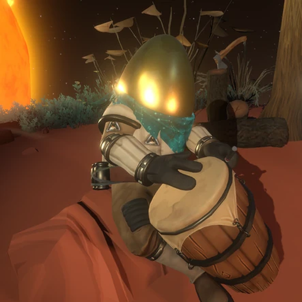

<p align="center">
  
</p>

<h1 align="center">chert 🔭</h1>

<p align="center"><i>Watch, steer, launch, fork and revive a whole fleet of Claude Code sessions from Discord.</i></p>

**Run a fleet of Claude Code sessions from Discord.** Every Claude Code session on your box
becomes a Discord thread you can read and type into from your phone. Launch new ones, watch
what they're doing in real time, answer their permission prompts with buttons, fork them,
restart them when stuck, ask *all* of them a question at once and get one synthesized answer,
send a second frontier model to review their work, and get plots posted inline the moment
they're made.

chert is a single Python process (`discord_bot.py`) plus a small web dashboard. It needs no
changes to Claude Code: it watches the session registry and transcripts Claude Code already
writes, gets nudged by Claude Code hooks, and types into sessions through tmux.

> Named for the [Hearthian](https://outerwilds.fandom.com/wiki/Chert) who sits at the top of the
> world with a telescope. The bridge's vocabulary follows: sessions are *travelers*, the
> dashboard is the *signalscope*, the S3 backup is the *Ash Twin*, and a session that ends has
> its 🌌 *loop end*.

---

## Contents

1. [What you get](#1-what-you-get)
2. [Quick start](#2-quick-start)
3. [Setting up the Discord bot](#3-setting-up-the-discord-bot)
4. [How it works](#4-how-it-works)
5. [Commands](#5-commands)
6. [`#all-claudes`: ask everyone, get one answer](#6-all-claudes-ask-everyone-get-one-answer)
7. [Feldspar: deep review by two frontier models](#7-feldspar-deep-review-by-two-frontier-models)
8. [Astra: GPT sessions alongside your Claudes](#8-astra-gpt-sessions-alongside-your-claudes)
9. [Plots, files and images](#9-plots-files-and-images)
10. [Configuration reference](#10-configuration-reference)
11. [Operations](#11-operations)
12. [Security notes](#12-security-notes)
13. [Troubleshooting](#13-troubleshooting)
14. [Layout of this repo](#14-layout-of-this-repo)
15. [License & credits](#15-license--credits)

---

## 1. What you get

| | |
|---|---|
| **A thread per session** | Every live Claude Code session on the machine gets its own thread in `#claudes`, titled with the session's name. Replies you type there are typed into that Claude's terminal. Attachments are saved to disk and the path is passed along. |
| **Live activity card** | While a Claude works, one message per turn is edited in place: what it's doing, the command, its latest thought, a tool tally, elapsed time, and **which model the turn ran on**. Edits never ping you. |
| **Prompts as buttons** | When a Claude asks a permission question or shows a menu, the options arrive as Discord buttons. Tap to answer. `!key esc` / `!key enter` for anything else. |
| **Launch from Discord** | `/claude <prompt>` or `@chert <prompt>` starts a new Claude in tmux and opens its thread. First word can name a project directory. |
| **Fork, revive, restart, refresh** | Clone a session with its history (`!fork`), bring back an ended or crashed one (`!revive`), restart in place to pick up new settings (`!restart`), or **unstick a frozen one** with escalating gentleness (`!refresh`). |
| **Rename, mute, kill** | `!rename`, `!mute`, `!kill` — all from the thread. |
| **The board** | One pinned message in `#claudes`, edited in place, listing every traveler with status and thread link, needs-you first. Quiet by default. |
| **Ask everyone** | A message in `#all-claudes` goes to every live Claude; their replies are collected and handed to a persistent **summarizer Claude** that answers in the channel and can interrogate individual Claudes. |
| **Second opinions** | `let feldspar look into this` sends the latest Claude *and* GPT (via Codex) to adversarially review a project or session and write a report. |
| **GPT sessions too** | `/astra` runs a GPT-6 (Codex) session as a Discord thread, with the same reply-to-talk model. `!fork astra` hands a Claude's conversation to GPT. |
| **Plots inline** | Any image a Claude opens with its Read tool is posted into its thread automatically; `hearth-send <file>` posts anything else. |
| **Model + classifier visibility** | Each card and status line shows the model in use; the first time Claude Code's classifier reroutes a turn to another model you get a ⤵️ alert, and blocked actions get a 🚧 line. `!bypass` switches that session out of the classifier's mode. |
| **Persistence** | Sessions that were live before a reboot come back automatically. Ended sessions stay revivable from their thread for 14 days. A searchable `/resume` covers every session the box has ever had. |
| **Disk watchdog + S3** | Warns when the disk runs low, backs up transcripts hourly to S3, and can offload cold project directories with verified uploads. |
| **Dashboard** | A small web UI (`app.py`) with every session's live transcript and a send box. |

## 2. Quick start

You need: a Linux box (Ubuntu 24.04 tested) with **Claude Code** installed and logged in,
**tmux**, **Python ≥ 3.11**, and a Discord server you administer.

```bash
git clone https://github.com/ceselder/chert.git ~/chert && cd ~/chert
./setup.sh
```

`setup.sh` walks you through everything: it creates the virtualenv, asks for your bot token
(hidden prompt), **builds the Discord channels for you**, installs the CLI helpers and Claude
Code hooks, renders systemd units for *your* user and paths, and starts the services. It is
idempotent; re-run it any time. Flags: `--skip-discord`, `--no-systemd`, `--dry-run`.

Then, in `#claudes`: **`/claude hello`**. A Claude appears as a thread. Type `!help` in it.

## 3. Setting up the Discord bot

You only do the first three steps by hand; `setup_discord.py` (run by `setup.sh`) does the rest.

1. Go to <https://discord.com/developers/applications> → **New Application** → name it `chert`.
2. **Bot** tab → **Reset Token** → copy it. Paste it when `setup.sh` asks (or put it in `.env`
   as `DISCORD_BOT_TOKEN`).
3. Still on the Bot tab → **Privileged Gateway Intents** → enable **MESSAGE CONTENT INTENT** →
   Save. Without it the bot can't read what you type.
4. `setup_discord.py` decodes the application id from the token and prints the **invite link**
   with exactly the permissions chert needs and both OAuth scopes (`bot` and
   `applications.commands` — slash commands silently fail to register without the second one).
   Click it, pick your server. The script waits for the bot to arrive.
5. It then creates a `chert` category with `#claudes` (main), `#claude-chat` (the claude↔claude
   bus) and `#all-claudes` (ask-everyone), sets their topics, and writes the ids and your owner
   id into `.env`.

Re-run `./setup_discord.py --check` any time to verify the token, server, channels and permissions.

## 4. How it works

```
 Claude Code sessions (tmux)          chert (discord_bot.py)                Discord
 ─────────────────────────            ──────────────────────                ───────
 ~/.claude/sessions/<pid>.json  ───►  registry poll (4 s) + hooks (instant)  ──► one thread per session
 ~/.claude/projects/**/*.jsonl  ───►  transcript tail → activity card,        ──► card edited in place,
   (transcripts)                       replies, model, classifier events          replies as the claude
 Notification / Stop hooks      ───►  prompt detection → buttons             ──► 📡 buttons you tap
 tmux pane                      ◄───  paste + Enter / keys / Esc             ◄── your messages, !commands
 messaging socket               ◄───  (background sessions without a pane)
```

- **Discovery.** Claude Code registers every session in `~/.claude/sessions/` with its pid, tmux
  pane, cwd, name and status. chert polls this and creates or ends threads accordingly. State is
  keyed by `pid:procStart`, so forks, `/clear` and renames keep their thread.
- **Streaming.** New transcript bytes are parsed each tick. Assistant text is posted under the
  Claude's own name (a webhook per channel, avatar seeded per session); tool runs collapse into
  one edited line; thinking and tool descriptions feed the activity card.
- **Hooks.** `hooks/install_hooks.py` adds a hook set to `~/.claude/settings.json` that POSTs
  SessionStart/End, Stop, StopFailure, Notification, Subagent and Compact events to the bridge
  on `127.0.0.1:8897` (shared secret). They make things instant; polling stays as the safety net.
  Events that arrive while the bridge is down are spooled and replayed.
- **Steering.** Your thread messages are pasted into the session's pane with a bracketed paste
  followed by Enter. Sessions without a pane but with an inbox socket get the message over the
  socket (📨). The owner's words arrive verbatim; other people's get a `name:` prefix.
- **Spawning.** New Claudes are started in a persistent tmux session (`0`, kept alive by
  `chert-tmux.service`) with `--allow-dangerously-skip-permissions` so `!bypass` is available,
  the project dir is trusted first, and first-run dialogs are auto-answered.

## 5. Commands

Type `!help` anywhere for the in-Discord version. `/` commands are real slash commands.

**In a session's thread**

| command | what |
|---|---|
| *(any text)* | typed into that Claude. Attachments → saved to `ATTACH_DIR`, path passed along |
| `!screen` | the current terminal screen; prompt buttons if it's waiting |
| `!key esc` | send a key: esc, enter, up, down, tab, shift-tab, space, 1–9 |
| `!fork [message]` · `/fork` | clone into a new Claude (own tmux window, same history, own thread). Names count: `x-fork`, `x-fork2`… |
| `!fork astra [message]` · `/fork to:astra` | hand this conversation to a GPT session (see §8) |
| `!refresh [message]` · `/refresh` · `!unstick` | **stuck?** Esc first; in-place restart only if still frozen; revive if dead. Idle + recently active ⇒ "not stuck", just delivers your message (`!refresh force`) |
| `!restart [force]` | clean exit + `claude -r` in the same pane, same flags, thread kept — picks up new settings/keys/hooks |
| `!revive [force\|fork]` | resume an ended/crashed/background session into tmux so you can talk to it |
| `!rename <name>` · `/rename` | drives Claude Code's `/rename`; thread title follows |
| `!effort <low\|medium\|high\|xhigh\|max>` · `/effort` | set this claude's reasoning effort (drives Claude Code's `/effort`) |
| `!model <name>` · `/model` | **owner only** — switch this claude's model (fable, opus, sonnet, haiku, full id); busy ⇒ queued until idle |
| `!bypass` · `!auto` · `!mode <x>` · `/mode` | switch permission mode. `!bypass` = the classifier off for this session; `!auto` = on |
| `!mute` / `!unmute` | pause this thread's updates |
| `!log [n\|all]` | the *ship log*: prompts, first sentence of each reply, tool bursts, with timestamps |
| `!supernova [22m] [stop\|kill]` | a countdown; at zero the Claude is told to wrap up and report |
| `let feldspar look into this [focus]` · `!feldspar` · `/feldspar` | deep review of this session's project (§7) |
| `!astra <prompt>` | a GPT session on this project (§8) |
| `!kill [hard\|delete]` | end this Claude + archive the thread (hard: kill its pane; delete: remove the thread) |

**In `#claudes` (the main channel)**

| command | what |
|---|---|
| `/claude <prompt> [project]` · `@chert <prompt>` | launch a new Claude; first word may name a project dir |
| `/resume` · `!resume [words]` | searchable list of **every session ever** (disk or S3); pick one to bring up |
| `!sessions` (= `!threads`, `!ls`) | every live Claude as a clickable thread link (works anywhere) |
| `!all <msg>` | broadcast to every live Claude |
| `/globalmodel <name>` · `!globalmodel` | **owner only** — switch every live Claude to a model and make it the default for new ones (settings.json) |
| `!restart all [force]` | rolling in-place restart of every idle session |
| `!revive all` | bring back everything that died in a reboot/crash |
| `!cleanup [delete]` | archive (or delete) every dead thread |
| `!yolo 1h` / `!yolo off` | bypassPermissions for Claudes started in the window |
| `!feldspar <dir> [focus]` · `!astra <dir> <prompt>` | review / GPT session on a named project |
| `!disk` · `!offload <dir> [confirm]` · `!restore <dir> confirm` · `!backup` · `!s3` | Ash Twin (S3) tools, §11 |

**Slash commands registered:** `/claude`, `/resume`, `/fork`, `/rename`, `/effort`, `/model`, `/globalmodel`, `/refresh`, `/mode`,
`/astra`, `/feldspar`, `/sessions`.

## 6. `#all-claudes`: ask everyone, get one answer

A plain message in `#all-claudes` is an **ask-round**:

1. The question is framed and delivered to every live Claude.
2. chert watches each one's transcript from that moment and takes its next reply, for up to
   `ASK_COLLECT_SECS` (4 min), editing one status line in place (`3/7 replied…`).
3. The bundle — question, then per Claude its name, project, status, transcript path and reply
   (or "no reply in the window") — is written to `ASK_DIR/round-<stamp>.md`.
4. It's handed to the **summarizer**: a persistent Claude session named `all-claudes-hub`,
   spawned on first use and reused across rounds so it builds context. Its replies are mirrored
   into `#all-claudes`. It's told to lead with the conclusion, attribute per Claude, flag
   contradictions and non-responders, and never redo the work.
5. It can **follow up with an individual Claude** using Claude Code's own cross-session
   `ListAgents` + `SendMessage`.

Talk to the summarizer alone by **replying** to one of its messages or with `!hub <msg>`.
`!all <msg>` there is a plain broadcast with no summary.

## 7. Feldspar: deep review by two frontier models

In a session's thread, `let feldspar look into this` (optionally with a focus). Two independent
reviewers start on that session's project and transcript:

- the latest Claude (`FELDSPAR_CLAUDE_MODEL`, effort `max`) as a real tmux session with its own
  thread, told to fan out with agent teams and verify every finding against the code;
- GPT (`FELDSPAR_OPENAI_MODEL`, default `gpt-6-astra` at `ultra`) headless through `codex exec`
  in a read-only sandbox.

Both write into `REPORTS_DIR/feldspar-<name>-<stamp>/`. When the GPT report lands, it's typed
into the Claude reviewer's session, which verifies and folds it in (confirmed / refuted / new)
and republishes `report.md` + `report.html`. In the main channel, name the project:
`!feldspar <dir> [focus]`.

**Requires** the Codex CLI logged in (`codex login`). See §13 for the Ubuntu 24.04 sandbox note.

## 8. Astra: GPT sessions alongside your Claudes

`!astra [dir] <prompt>` (or `/astra`) opens a thread bound to a Codex thread on `ASTRA_MODEL`
(`gpt-6-astra`). Each message in the thread is one headless `codex exec resume` turn; an
activity card shows commands, thoughts and edits; the final answer is posted; messages sent
mid-turn queue up. `!effort low|medium|high|xhigh|max|ultra` per thread, `!kill` ends it. The
Codex thread id is persisted, so a session survives bridge restarts.

`!fork astra [message]` in a Claude's thread renders that conversation to a handoff file and
starts an Astra session that reads it first — "don't redo finished work, then <message>".

## 9. Plots, files and images

- **Automatic:** any image (`.png .jpg .jpeg .gif .webp`) a Claude opens with its **Read tool** is
  posted into its thread. If your `CLAUDE.md` tells Claude to open every plot it makes with the
  Read tool (recommended — it also renders in the terminal), plots reach Discord with no effort.
  Each image is posted once per version; oversized ones post the path.
- **Explicit:** `hearth-send <file> [caption]` from inside a session posts any file (a
  `report.html`, a PDF, a CSV) into that session's thread. It finds the thread by the tmux pane
  it's run from.
- **Inbound:** attachments you post in a thread are saved to `ATTACH_DIR` and the path is typed
  to the Claude.

## 10. Configuration reference

All configuration is environment variables in `.env` (see `.env.example`, which documents each).
Required: `DISCORD_BOT_TOKEN`, `DISCORD_CHANNEL_ID`, `PYTHONUNBUFFERED=1`. Everything else has a
default.

| group | variables |
|---|---|
| Discord | `DISCORD_BOT_TOKEN` `DISCORD_CHANNEL_ID` `DISCORD_CHAT_CHANNEL_ID` `DISCORD_BROADCAST_CHANNEL_ID` `DISCORD_BROADCAST_CHANNEL_NAME` `DISCORD_OWNER_ID` `PROMPT_CHANNEL_ID` `POLL_SECS` |
| Spawning | `PROJECT_ROOT` `TMUX_SESSION` `CLAUDE_BIN` `SPAWN_FLAGS` `PERMISSION_MODE` `SPAWN_ALLOW_USERS` |
| Persistence / board | `REVIVE_ON_BOOT` `REVIVE_ON_CRASH` `ENDED_KEEP_DAYS` `ANNOUNCE_NEW` `BOARD` |
| Disk + S3 | `S3_BUCKET` `DISK_WARN_GB` `DISK_CRIT_GB` `AUTO_OFFLOAD` `ASH_HOME` `ASH_MANIFEST` |
| Feldspar | `FELDSPAR_CLAUDE_MODEL` `FELDSPAR_CLAUDE_EFFORT` `FELDSPAR_OPENAI_MODEL` `FELDSPAR_OPENAI_EFFORT` `FELDSPAR_TIMEOUT` `FELDSPAR_CODEX_SANDBOX` `FELDSPAR_CODEX_UNSANDBOXED_FALLBACK` `REPORTS_DIR` `REPORTS_URL` `CODEX_BIN` `CODEX_BRIDGE_HOME` |
| Astra | `ASTRA_MODEL` `ASTRA_EFFORT` `ASTRA_SANDBOX` `ASTRA_TURN_TIMEOUT` `ASTRA_RETRIES` `ASTRA_LOG_DIR` `ASTRA_HANDOFF_CHARS` |
| Ask-rounds | `ASK_COLLECT_SECS` `ASK_HUB_NAME` `ASK_DIR` |
| Hooks + files | `HEARTH_HOOK_PORT` `HEARTH_HOOK_SECRET` `HEARTH_HOOK_SPOOL` `HEARTH_FILE_LIMIT` `ATTACH_DIR` |
| Dashboard | `CLAUDE_HOME` `CLAUDE_SETTINGS` `DASHBOARD_URL` `DASH_USER` `DASH_PASS` `DASH_UPSTREAM` |
| Cosmetics | `AVATAR_URL` `AVATAR_FILE` |

Worth setting for your own box: `DASHBOARD_URL` (defaults to loopback `http://127.0.0.1:8899/claudes`;
point it at wherever you expose the dashboard behind auth so `[dashboard]` links work on your phone),
`REPORTS_URL` (blank = Feldspar reports are linked by file path; set it if a web server serves
`REPORTS_DIR`), and `S3_BUCKET` (blank = Ash Twin backup/offload disabled).

## 11. Operations

- **Services** (from `setup.sh`): `chert-tmux` (the tmux server), `chert-discord-bridge`,
  `chert-checkin` (dashboard on `127.0.0.1:8899`). Logs: `journalctl -u chert-discord-bridge -f`.
- **Update:** `git pull && sudo systemctl restart chert-discord-bridge`. Running Claude sessions
  are unaffected by a bridge restart. Astra/Feldspar Codex turns are children of the bridge, so
  wait for those to finish (the restart would kill them).
- **State** lives in `bot_state.json` (atomic writes, `.bak` every 6 h). Deleting it makes the
  bridge open a fresh thread for every live session.
- **Reboots:** with `REVIVE_ON_BOOT=1`, every session that was live is resumed into tmux and its
  thread continues.
- **Ash Twin (S3):** `!backup` syncs transcripts and config now (a systemd timer can do it
  hourly); `!disk` shows free space and the biggest cold directories; `!offload <dir> confirm`
  copies a directory to S3, verifies every object, deletes it locally and leaves a marker;
  `!restore <dir> confirm` brings it back. Needs `aws` credentials and `S3_BUCKET`.
- **Dashboard exposure:** `app.py` has no auth of its own and can type into sessions. Keep it on
  loopback, or put nginx basic-auth or `dashboard_proxy.py` (basic auth, binds one address) in
  front of it.

## 12. Security notes

- **Secrets never live in the repo.** `.env` is gitignored and `chmod 600`; the git history has
  been scanned clean. Don't commit `bot_state.json` (thread ids) either — it's ignored too.
- **The hook endpoint** is loopback-only and requires the shared secret in
  `~/.claude/hearth-hook.secret` (created by `install_hooks.py`). `hearth-send` uses the same secret.
- **Spawned Claudes run with `--allow-dangerously-skip-permissions`** so `!bypass` is available.
  That's the point of a phone-driven fleet, but be aware of what it means on a shared machine.
  `SPAWN_ALLOW_USERS` restricts who can launch Claudes.
- **The classifier.** In Claude Code's *auto* permission mode a classifier can block tool calls
  and reroute a turn to another model. chert makes both visible and gives you `!bypass` to leave
  that mode per session. That's a deliberate lever; use it knowingly.
- **API keys for your Claudes' code** are a separate concern from chert. A pattern that works
  well: keep them encrypted locally and inject them per process (an `age`-encrypted dotenv plus a
  `with-keys`-style wrapper), never in `CLAUDE.md` — anything in `CLAUDE.md` ends up in every
  transcript.

## 13. Troubleshooting

| symptom | cause / fix |
|---|---|
| Bot online but ignores messages | Message Content intent is off. Developer Portal → Bot → Privileged Gateway Intents. |
| `slash command sync failed` in the log | Bot was invited without `applications.commands`. Re-invite with the link from `./setup_discord.py`. `!` commands work regardless. |
| `/claude` does nothing, "never registered a session" | No tmux session `0`: `systemctl status chert-tmux`. Or `claude` isn't on PATH for the service user (`CLAUDE_BIN`). Or a login screen is up in the pane — `tmux attach`. |
| Threads keep getting recreated | `bot_state.json` was lost or the disk filled up during a write. |
| Codex review ends instantly with `bwrap: loopback: Failed RTM_NEWADDR` | Ubuntu 24.04 restricts unprivileged user namespaces. Install `bubblewrap` and load `sandbox/bwrap-userns-restrict` into AppArmor (see the file). chert detects this and retries unsandboxed unless `FELDSPAR_CODEX_UNSANDBOXED_FALLBACK=0`. |
| GPT model rejected as "requires a newer version of Codex" | Two Codex versions sharing `~/.codex/models_cache.json`. chert gives its Codex a private `CODEX_HOME` (`CODEX_BRIDGE_HOME`, default `~/.codex-bridge`) so this doesn't happen. |
| `Unknown Channel` card errors | A thread was deleted by hand; the bridge recreates on the next tick. |
| A Claude looks stuck | `!refresh`. If Esc alone frees it you keep the turn's context; otherwise it's restarted in place with history. |
| Discord 503 / rate limits in the log | Discord-side; the bridge retries. Steering is queued, nothing is lost. |

## 14. Layout of this repo

```
discord_bot.py        the bridge (threads, cards, commands, Feldspar, Astra, ask-rounds)
app.py                dashboard + transcript parser shared with the bridge
ash_twin.py           S3 backup / offload
dashboard_proxy.py    basic-auth reverse proxy for the dashboard
setup.sh              installer (venv, .env, Discord, hooks, helpers, systemd)
setup_discord.py      builds the Discord channels from the bot token
bin/hearth-send       post a file/image into your session's thread
bin/model-check       which model each live session is really running (reroutes included)
hooks/                Claude Code hook + installer
systemd/templates/    unit templates rendered by setup.sh for your user and paths
sandbox/              AppArmor profile for Codex's bubblewrap sandbox (Ubuntu 24.04)
static/, templates/   dashboard assets
docs/IDEAS.md         ranked backlog of ideas
LICENSE               MIT (code); the Chert artwork is not covered, see §15
```

## 15. License & credits

The code is **MIT** licensed — see [`LICENSE`](LICENSE). Take it, bend it, name your travelers
after your own favorite explorers.

The Chert artwork (`static/chert.png`) depicts a character from
[**Outer Wilds**](https://www.mobiusdigitalgames.com/outer-wilds.html) by Mobius Digital. It is
**not** covered by the MIT license; it's here as a fan tribute. chert is an unofficial fan project
with no affiliation to Mobius Digital, Annapurna Interactive, or Anthropic. If you fork this for
something public-facing, consider swapping in your own mascot.

Built on [Claude Code](https://claude.com/claude-code), [discord.py](https://github.com/Rapptz/discord.py),
and (optionally) the [Codex CLI](https://github.com/openai/codex). Go play Outer Wilds. 🌌
